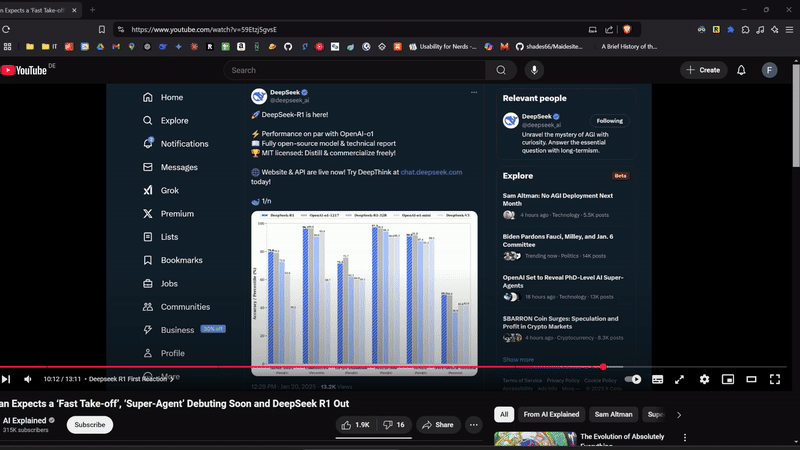

# YT2Prompt

A Chrome extension that transforms YouTube transcripts into AI-ready prompts. Easily analyze video content with various AI services using predefined prompt templates.



## Features

- 🎯 Extract transcripts from any YouTube video
- 🤖 Direct integration with multiple AI services:
  - ChatGPT
  - Claude
  - DeepSeek
  - Gemini
- 📝 Pre-configured prompt templates:
  - Tutorial Step-by-Step Plan
  - Detailed Summary with Context
- 💾 Remembers your last selected prompt and AI service
- 🎨 Clean, modern dark mode interface
- 📋 Multiple copy options:
  - Copy transcript only
  - Copy with selected prompt
  - Directlink to AI chat services

## Installation

### Development Setup
1. Clone this repository:
```bash
git clone [repository-url]
cd yt2prompt
```

2. Install dependencies:
```bash
npm install
```

3. Build the extension:
```bash
npm run build
```


### Loading in Chrome
1. Open Chrome and navigate to `chrome://extensions/`
2. Enable "Developer mode" in the top right
3. Click "Load unpacked"
4. Select the `dist` directory from your project folder

## Usage

1. Navigate to any YouTube video
2. Click the extension icon in your browser toolbar
3. The transcript will be automatically loaded
4. Choose your options:
   - Select a prompt template (optional)
   - Select an AI service
   - Use one of the action buttons:
     - "Copy Transcript": Copy just the transcript
     - "Copy with Prompt": Copy transcript with the selected prompt
     - "Open in AI Chat": Opens the selected AI service and pastes the content

## Prompt Templates

### Tutorial Step-by-Step Plan
Transforms tutorial videos into structured, actionable plans with:
- Required tools and materials
- Step-by-step instructions
- Additional tips and notes

### Detailed Summary with Context
Creates comprehensive summaries while preserving:
- Key points and details
- Important quotes
- Context and nuance

## Supported AI Services

- **DeepSeek Chat**: `chat.deepseek.com`
- **ChatGPT**: `chat.openai.com`
- **Claude**: `claude.ai`
- **Gemini**: `gemini.google.com`

## Development

### Project Structure
```
yt2prompt/
├── src/
│   ├── contentScript.js    # YouTube page script
│   ├── llmContentScript.js # AI services integration
│   └── popup.js           # Extension popup logic
├── popup.html             # Extension popup UI
├── prompts.json          # Prompt templates and services
├── manifest.json         # Extension configuration
└── package.json         # Project dependencies
```

### Building
- Development build: `npm run build`
- Watch mode: `npm run watch`

### Adding New Features

#### Adding a New AI Service
1. Add the service to `prompts.json`:
```json
{
  "llmServices": [
    {
      "id": "new-service",
      "name": "Service Name",
      "url": "https://service-url.com"
    }
  ]
}
```

#### Adding a New Prompt Template
Add to the `prompts` array in `prompts.json`:
```json
{
  "id": "new-prompt",
  "name": "Prompt Name",
  "template": "Your prompt template here... {transcript}"
}
```


## License

MIT License

## Acknowledgments

- Uses the `youtube-transcript` package for transcript extraction
- Built with Parcel bundler
- Inspired by the need for better YouTube content analysis